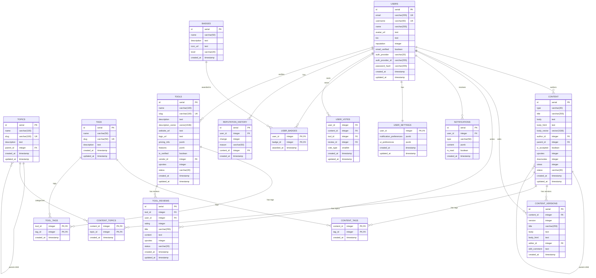

# Database Schema

## Entity Relationship Diagram

## Table Descriptions

### Users
Stores user accounts and profile information.

### Topics
Hierarchical categories for organizing content. Topics can have parent-child relationships.

### Tags
Free-form tags that can be applied to content and tools.

### Content
The main content entity, which includes questions, answers, posts, tutorials, and comments.

### Content_Versions
Tracks version history for content, allowing users to see previous revisions.

### Content_Tags
Junction table linking content to tags.

### Content_Topics
Junction table linking content to topics.

### Tools
AI tools listed in the directory.

### Tool_Tags
Junction table linking tools to tags.

### Tool_Reviews
User reviews of tools.

### Badges
Achievement badges that can be earned by users.

### User_Badges
Junction table tracking which badges have been awarded to which users.

### Notifications
User notifications for various events.

### User_Settings
User preferences for notifications and UI.

### User_Votes
Tracks user votes on content, tools, and reviews.

### Reputation_History
Records changes to user reputation and the reasons for those changes.

## Indexing Strategy

The following indexes are created to optimize query performance:

- Vector indexes on `content.body_vector` and `tools.description_vector` for efficient similarity searches
- Indexes on foreign keys for efficient joins
- Composite indexes on frequently queried columns
- Partial indexes for filtering by status

## Data Types

- `vector(1536)`: Custom data type for pgvector extension, used for semantic search
- `jsonb`: JSON data with binary storage, used for structured data that doesn't need its own table
- Other standard PostgreSQL data types

## Data Validation

Data validation is handled at multiple levels:

1. **Database constraints**: Primary keys, foreign keys, check constraints
2. **Application validation**: Using Zod schemas before data reaches the database
3. **Triggers**: For complex validations and maintaining data integrity

## Data Migration Strategy

For schema changes, we use node-pg-migrate to create migrations that:

1. Are reversible (have both up and down methods)
2. Include data transformations when necessary
3. Add appropriate indexes and constraints